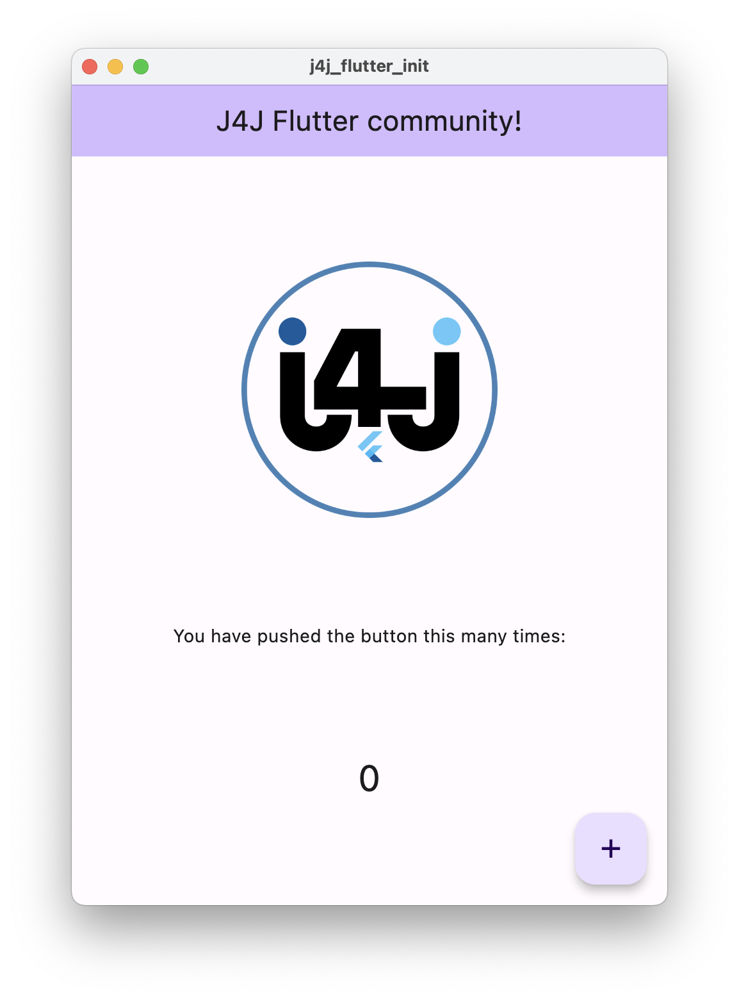

# First video - How to create the j4j_flutter_first_steps project

- [First video - How to create the j4j\_flutter\_first\_steps project](#first-video---how-to-create-the-j4j_flutter_first_steps-project)
  - [What we wiil do in the episode](#what-we-wiil-do-in-the-episode)
  - [🔔 Assumptions 🔔](#-assumptions-)
    - [Steps](#steps)
      - [1. Create a new flutter project](#1-create-a-new-flutter-project)
      - [3. Run the project on several emulators](#3-run-the-project-on-several-emulators)
      - [4. Remove the annoying debug banner from the MaterialApp widget](#4-remove-the-annoying-debug-banner-from-the-materialapp-widget)
      - [5. Add assets to the project](#5-add-assets-to-the-project)
        - [5.1 Assets directory](#51-assets-directory)
        - [5.2 pubspec.yml configuration](#52-pubspecyml-configuration)
      - [6. Change the code to use the assets and see what "hot-reload" is all about](#6-change-the-code-to-use-the-assets-and-see-what-hot-reload-is-all-about)
      - [7. Change the title to: `J4J Flutter community!`](#7-change-the-title-to-j4j-flutter-community)

## What we wiil do in the episode

In this episode we will create a new flutter project, add images, and update the code to use the images we added.

## 🔔 Assumptions 🔔

in this video and the next video I'll assume that you have `flutter` configured and the command:
`flutter doctor` run with no issues and you have installed either `Visual Studio Code` or `Android Studio`

---

Steps and TODOs in this episode:

1. Create a new flutter project
2. Explain what the project structure 🏗️
3. Run the project on several emulators 💻 📱
4. Remove the annoying debug banner from the `MaterialApp` widget
5. Add assets to the project 🖼️
   1. Assets directory
   2. pubspec.yml configuration
6. Change the code to use the assets and see what "hot-reload" is all about.
7. Change the title to: `J4J Flutter community!`

### Steps

#### 1. Create a new flutter project

```bash
flutter create j4j_flutter_first_steps
```

---

#### 3. Run the project on several emulators

This step can be done in two ways:

1. Via the terminal:

   `flutter run` and continue with the prompts, or with a specific device-id from `flutter devices` and run the command:

    ```bash
    flutter run -d <device-id>
    ```

2. Using the IDE controls

    ***note: Will be shown in the video***

---

#### 4. Remove the annoying debug banner from the MaterialApp widget

before:


lib/main.dart:

```diff
   void main() {
     runApp(MyApp());
   }
   
   class MyApp extends StatelessWidget {
     // This widget is the root of your application.
     @override
     Widget build(BuildContext context) {
       return MaterialApp(
+        debugShowCheckedModeBanner: false,
         title: 'Flutter Demo',
         theme: ThemeData(
           primarySwatch: Colors.blue,
         ),
         home: MyHomePage(title: 'Flutter Demo Home Page'),
       );
```

after:


---

#### 5. Add assets to the project

##### 5.1 Assets directory

   1. Create the directory

        ```bash
        mkdir -p assets/images
        ```

   2. Download the [assets](https://drive.google.com/drive/u/0/folders/1O_ygXaoZbHNMlWs8mVLm6Y8iGOyujfyz) from the community google drive to the new directory. *Download the PNGs only*

##### 5.2 pubspec.yml configuration

```diff
   # To add assets to your application, add an assets section, like this:
-  # assets:
-  #   - images/a_dot_burr.jpeg
-  #   - images/a_dot_ham.jpeg
+  assets:
+    - assets/images/j4j_Flutter_circle_logo_light_mode.png
+    - assets/images/j4j_Flutter_circle_logo_dark_mode.png
+    - assets/images/j4j_flutter_logo_dark_mode.png
+    - assets/images/j4j_flutter_logo_light_mode.png
+    - assets/images/j4j_logo_with_flutter_dark_mode.png
+    - assets/images/j4j_logo_with_flutter_light_mode.png
```

Note:
on some platforms, you may need to do *Hard restart* (full stop and restart) to see the changes.

---

#### 6. Change the code to use the assets and see what "hot-reload" is all about

in *lib/main.dart*:

```diff
           // TRY THIS: Invoke "debug painting" (choose the "Toggle Debug Paint"
           // action in the IDE, or press "p" in the console), to see the
           // wireframe for each widget.
-          mainAxisAlignment: MainAxisAlignment.center,
+
+          // Just like in css with the display flex and justify-content: space-evenly
+          mainAxisAlignment: MainAxisAlignment.spaceEvenly,
           children: <Widget>[
+            SizedBox(
+              // container with a fixed size to contain the image
+              width: 200,
+              // inside the container, we have an image that load from an assets the image we want
+              child: Image.asset(
+                "assets/images/j4j_Flutter_circle_logo_light_mode.png", // path to the image
+              ),
+            ),
             const Text(
               'You have pushed the button this many times:',
             ),
```


---

#### 7. Change the title to: `J4J Flutter community!`

```diff
         backgroundColor: Theme.of(context).colorScheme.inversePrimary,
         // Here we take the value from the MyHomePage object that was created by
         // the App.build method, and use it to set our appbar title.
-        title: Text(widget.title),
+        title: const Text("J4J Flutter community!"),
       ),
       body: Center(
         // Center is a layout widget. It takes a single child and positions it
```

   *Note: is their another way to change the title?? try to find it.*

   

---

Exercises:

1. Change the app to dark mode (clue: ColorScheme.brightness)

   In the future we will define a different approach to dark mode

2. The picture has almost blend with the background. How are you going to fix that?
